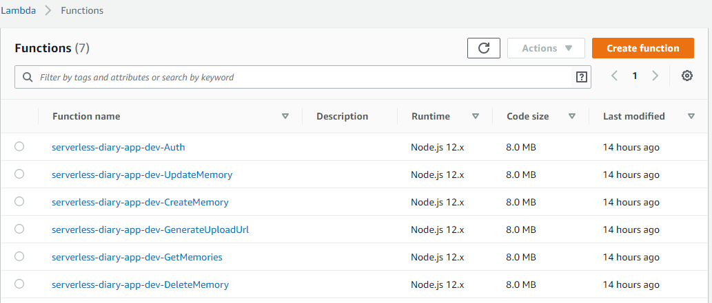
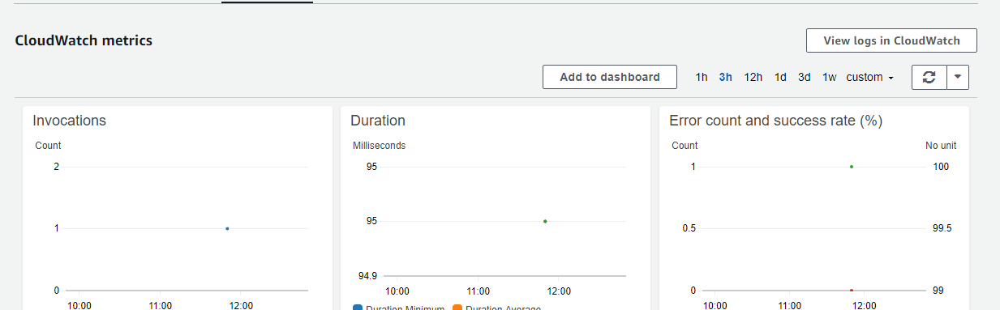
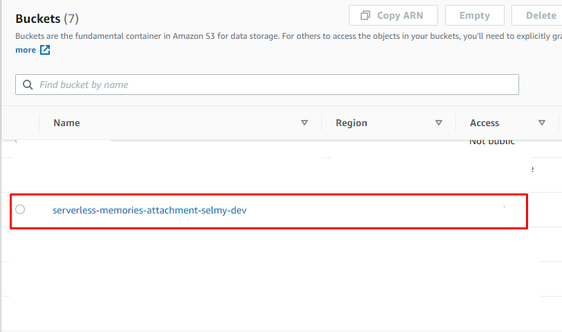
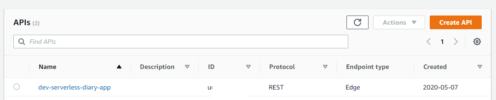
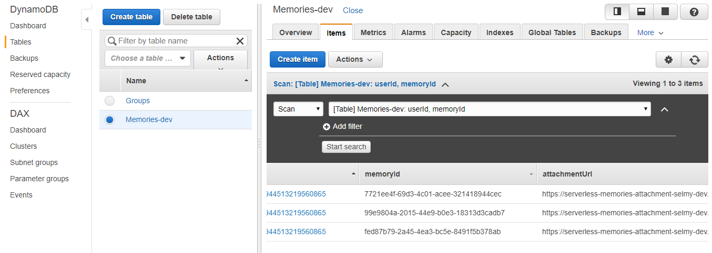

# Diary Serverless Application
This is a diary api that exposes RESTful API for client application that allows it to add memoried in dynamoDB database, attachment file to S3 bucket and monitor lambda logs via cloudwatch.

> # AWS :
>> ## Lambda functions
>> 
>> ## Monitoring using cloudwatch
>> 
>> ## S3 Bucket
>> 
>> ## API Gatway
>> 
>> ## DynamoDB
>> 